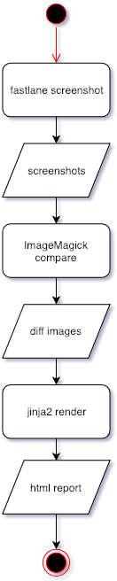

UIAutomation + Fastlane Screenshots + ImageMagick Demo
===
Article: [https://tyy.sh/blog/e229c7fc63b6](https://tyy.sh/blog/e229c7fc63b6)

Installation
===
```shell
$ bundle install --path vendor/bundle
$ pip install -r requirements.txt
```

#### ImageMagick 6
[stackoverflow - How to use or install MagickWand on Mac OS X?](https://stackoverflow.com/questions/24803747/how-to-use-or-install-magickwand-on-mac-os-x)

```shell
$ brew uninstall --force imagemagick
$ brew install imagemagick@6
$ echo 'export PATH="/usr/local/opt/imagemagick@6/bin:$PATH"' >> ~/.bash_profile
$ brew link imagemagick@6 --force
```

Usage
===
```shell
$ bundle exec fastlane snapshot
$ python script/compare_images.py -a screenshots-answers/en-US -i screenshots/en-US -o screenshots-diff
```

Workflow
===

